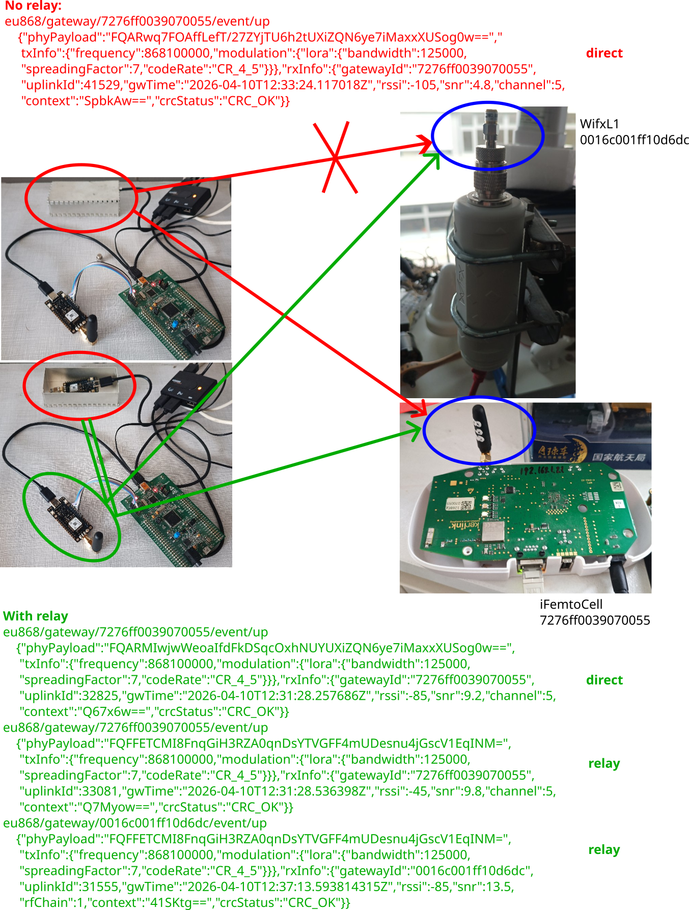

# Meshcore relay to LoRaWAN gateway

See <a href="https://gricad-gitlab.univ-grenoble-alpes.fr/meshtastic/meshcore/-/blob/main/build.md">
this web page</a> on how to build ``meshcore``, and <a href="https://gricad-gitlab.univ-grenoble-alpes.fr/meshtastic/meshcore/-/blob/main/settings.lorawan.md">
on how to update the configuration to be compatible with a LoRaWAN gateway</a> (tested with iFemtoCell and WifxL1).

To summarize:
```
git clone https://github.com/meshcore-dev/MeshCore.git meshcore_firmware
cd meshcore_firmware/
export PATH=$PATH:$HOME/.platformio/penv/bin
export FIRMWARE_VERSION=companion-v1.9.0
./build.sh build-firmware wio-e5-mini_repeater
```
assuming ``platformio`` was installed according to <a href="https://docs.platformio.org/en/latest/core/installation/methods/installer-script.html">
the command line installer script</a>.

The first time we wish to overwrite the default Seeedstudio E5-mini firmware, we get the
error message ``Error: stm32x device protected``. Removing the protection is achieved
with OpenOCD:
```
$ openocd -d2 -s $HOME/.platformio/packages/tool-openocd/openocd/scripts -f interface/stlink.cfg -c "transport select hla_swd" -f target/stm32wlx.cfg
$ telnet localhost 4444
> stm32wlx options_read
> stm32wlx unlock 0    
device idcode = 0x10016497 (STM32WLE/WL5x - Rev 'unknown' : 0x1001)
RDP level 1 (0x00)
flash size = 256 KiB
flash mode : single-bank
> reset run
```

When compiling with
```
BOARD=wio-e5-mini
NODE_TYPE=sensor
pio run -e ${BOARD}_${NODE_TYPE} -t upload
```
the resulting node is unable to communicate with the meshcore interface. Instead,
```
BOARD=wio-e5-mini
NODE_TYPE=companion_radio_usb
pio run -e ${BOARD}_${NODE_TYPE} -t upload
```
will provide a function interface for communicating with meshcore. To do so:
```
pip install meshcore-cli
meshcore-cli -l
meshcore-cli -s /dev/ttyUSB3 infos
```
resulting in
```
INFO:meshcore:Connected to B7630D6C running on a v1.14.1 fw.
{
    "adv_type": 1,
    "tx_power": 22,
    "max_tx_power": 22,
    "public_key": "b7630d6c09bdab8f391727803f603d5eeaee6c9049fe397954abc85f22db52d1",
    "adv_lat": 0.0,
    "adv_lon": 0.0,
    "multi_acks": 0,
    "adv_loc_policy": 0,
    "telemetry_mode_env": 0,
    "telemetry_mode_loc": 0,
    "telemetry_mode_base": 0,
    "manual_add_contacts": false,
    "radio_freq": 869.618,
    "radio_bw": 62.5,
    "radio_sf": 8,
    "radio_cr": 5,
    "name": "B7630D6C"
}
```

After <a href="https://gricad-gitlab.univ-grenoble-alpes.fr/meshtastic/meshcore/-/blob/main/settings.lorawan.md">modifying</a> 
the firmware to comply with LoRaWAN packets, namely the PUBLIC header and 8-byte preamble, probing the MQTT broker connected
to the network server (192.168.1.170) to which to gateways are connected with
```
mosquitto_sub -h 192.168.1.170 -F '@Y-@m-@dT@H:@M:@S@z : %t : %j' -t '#'
```
and broadcasting a message with
```
meshcore-cli -s /dev/ttyUSB3 chat
public "hello"
```
we obtain
```
2026-04-10T10:47:20+0200 : eu868/gateway/7276ff0039070055/event/up : {"tst":"2026-04-10T10:47:20.835432+0200","topic":"eu868/gateway/7276ff0039070055/event/up","qos":0,"retain":0,"payloadlen":358,"payload":"{\"phyPayload\":\"FQARQrei3XXi0tHIk9DGz9DIYzetUXiZQN6ye7iMaxxXUSog0w==\",\"txInfo\":{\"frequency\":868100000,\"modulation\":{\"lora\":{\"bandwidth\":125000,\"spreadingFactor\":7,\"codeRate\":\"CR_4_5\"}}},\"rxInfo\":{\"gatewayId\":\"7276ff0039070055\",\"uplinkId\":15914,\"gwTime\":\"2026-04-10T08:41:36.434066Z\",\"rssi\":-40,\"snr\":9.5,\"channel\":5,\"context\":\"DZbqIw==\",\"crcStatus\":\"CRC_OK\"}}"}
2026-04-10T10:47:20+0200 : eu868/gateway/0016c001ff10d6dc/event/up : {"tst":"2026-04-10T10:47:20.852840+0200","topic":"eu868/gateway/0016c001ff10d6dc/event/up","qos":0,"retain":0,"payloadlen":363,"payload":"{\"phyPayload\":\"FQARQrei3XXi0tHIk9DGz9DIYzetUXiZQN6ye7iMaxxXUSog0w==\",\"txInfo\":{\"frequency\":868100000,\"modulation\":{\"lora\":{\"bandwidth\":125000,\"spreadingFactor\":7,\"codeRate\":\"CR_4_5\"}}},\"rxInfo\":{\"gatewayId\":\"0016c001ff10d6dc\",\"uplinkId\":18106,\"gwTime\":\"2026-04-10T08:47:20.850437385Z\",\"rssi\":-35,\"snr\":13.75,\"rfChain\":1,\"context\":\"rTjh0A==\",\"crcStatus\":\"CRC_OK\"}}"}
```
demonstrating the reception of two packets, one by the iFemtoCell 7276ff0039070055 and the other by the WifxL1 0016c001ff10d6dc),
both on 868100000 Hz as configured in the nodes.

The packet is indeed a meshcore packet since
```
$ echo "FQARd8Ro3WhWSzVLil/gTnqMB4AUUXiZQN6ye7iMaxxXUSog0w=="| base64 -d | xxd
00000000: 1500 1177 c468 dd68 564b 354b 8a5f e04e  ...w.h.hVK5K._.N
00000010: 7a8c 0780 1451 7899 40de b27b b88c 6b1c  z....Qx.@..{..k.
00000020: 5751 2a20 d3                             WQ* .
```
and 
```
meshcore-decoder 15001177c468dd68564b354b8a5fe04e7a8c07801451789940deb27bb88c6b1c57512a20d3
=== MeshCore Packet Analysis ===

Valid Packet
Message Hash: 1B7ABC17
Route Type: Flood
Payload Type: GroupText
Total Bytes: 37

=== Payload Details ===
Channel Hash: 11
Encrypted (no key available)
Ciphertext: 68DD68564B354B8A5FE04E7A8C078014...
```

but Olivier Testault identified <a href="https://pypi.org/project/meshcoredecoder">this library</a>
which does allow for decoding the public channel payload as demonstrated with
```
python3 decode.py
```
where ``hex_data = '15001177c468dd68564b354b8a5fe04e7a8c07801451789940deb27bb88c6b1c57512a20d3'``
is the data to be decoded, resulting in
```
Sender: B7630D6C
Message: "hello"
Timestamp: 1775810972
```

Once the private key for the public channel is known, we update the ``meshcore-decoder`` command
by adding the ``--key`` option with
```
meshcore-decoder 15001177c468dd68564b354b8a5fe04e7a8c07801451789940deb27bb88c6b1c57512a20d3 --key 8b3387e9c5cdea6ac9e5edbaa115cd72
```
resulting in
```
=== MeshCore Packet Analysis ===

Valid Packet
Message Hash: 1B7ABC17
Route Type: Flood
Payload Type: GroupText
Total Bytes: 37

=== Payload Details ===
Channel Hash: 11
Decrypted Message:
Sender: B7630D6C
Message: "hello"
Timestamp: 2026-04-10T08:49:32.000Z
```
which is again correctly decoded.

Finally, a meshcore relay (repeater) configured with
```
NODE_TYPE=repeater
pio run -e ${BOARD}_${NODE_TYPE} -t upload
```
is acting as expected:
* the iFemtoCell is fitted with an antenna and can receive messages from all nodes in the lab
* the WifxL1 is fitted with a 50 ohm load and can only receive messages from nodes fitted with an antenna
* one node acting as sensor is fitted with a 50 ohm load instead of the antenna and shielded in a metallic box (this
sensor cannot directly communicate with the WifxL1)
* one node acting as relay is fitted with an antenna and can communicate with both gateways.



Only when the relay is active does the network server receive packets from both gateways, demonstrating
that the relay is working as expected.

Connecting to the repeater to check the configuration:
```
meshcore-cli -s /dev/ttyUSB1 -r
wio-e5-mini Repeater> get repeat
  -> > on
```
