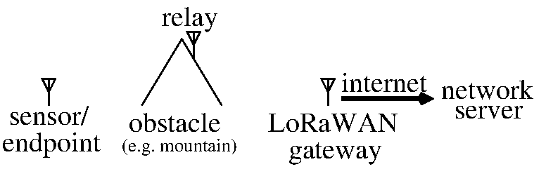

# Meshcore relay to LoRaWAN gateway

## Objective

The objective is to relay measurements collected by sensor nodes (endpoints)
to the LoRaWAN gateway (WifxL1 installed in Ny-Alesund, Spitsbergen) despite
obstacles (mountains) between the sensors and the gateway. Relaying messages
has not been part of the initial LoRaWAN definition but this web page summarizes
developments towards the use of Meshcore to achieve this result.



## Technical solution: Meshcore compilation

See <a href="https://gricad-gitlab.univ-grenoble-alpes.fr/meshtastic/meshcore/-/blob/main/build.md">
this web page</a> on how to build ``meshcore``, and <a href="https://gricad-gitlab.univ-grenoble-alpes.fr/meshtastic/meshcore/-/blob/main/settings.lorawan.md">
on how to update the configuration to be compatible with a LoRaWAN gateway</a> (tested with iFemtoCell and WifxL1).

To summarize:
```
git clone https://github.com/meshcore-dev/MeshCore.git meshcore_firmware
cd meshcore_firmware/
export PATH=$PATH:$HOME/.platformio/penv/bin
export FIRMWARE_VERSION=companion-v1.9.0
./build.sh build-firmware wio-e5-mini_repeater
```
assuming ``platformio`` was installed according to <a href="https://docs.platformio.org/en/latest/core/installation/methods/installer-script.html">
the command line installer script</a>.

The first time we wish to overwrite the default Seeedstudio E5-mini firmware, we get the
error message ``Error: stm32x device protected``. Removing the protection is achieved
with OpenOCD: **while pushing** on the RESET button, execute ``openocd`` with
```
$ openocd -d2 -s $HOME/.platformio/packages/tool-openocd/openocd/scripts -f interface/stlink.cfg -c "transport select hla_swd" -f target/stm32wlx.cfg
$ telnet localhost 4444
> stm32wlx options_read
> stm32wlx unlock 0    
device idcode = 0x10016497 (STM32WLE/WL5x - Rev 'unknown' : 0x1001)
RDP level 1 (0x00)
flash size = 256 KiB
flash mode : single-bank
> reset run
```

When compiling with
```
BOARD=wio-e5-mini
NODE_TYPE=sensor
pio run -e ${BOARD}_${NODE_TYPE} -t upload
```
the resulting node is unable to communicate with the meshcore interface. Instead,
```
BOARD=wio-e5-mini
NODE_TYPE=companion_radio_usb
pio run -e ${BOARD}_${NODE_TYPE} -t upload
```
will provide a functional interface for communicating with meshcore. To do so:
```
pip install meshcore-cli
meshcore-cli -l
meshcore-cli -s /dev/ttyUSB3 infos
```
resulting in
```
INFO:meshcore:Connected to B7630D6C running on a v1.14.1 fw.
{
    "adv_type": 1,
    "tx_power": 22,
    "max_tx_power": 22,
    "public_key": "b7630d6c09bdab8f391727803f603d5eeaee6c9049fe397954abc85f22db52d1",
    "adv_lat": 0.0,
    "adv_lon": 0.0,
    "multi_acks": 0,
    "adv_loc_policy": 0,
    "telemetry_mode_env": 0,
    "telemetry_mode_loc": 0,
    "telemetry_mode_base": 0,
    "manual_add_contacts": false,
    "radio_freq": 869.618,
    "radio_bw": 62.5,
    "radio_sf": 8,
    "radio_cr": 5,
    "name": "B7630D6C"
}
```

After <a href="https://gricad-gitlab.univ-grenoble-alpes.fr/meshtastic/meshcore/-/blob/main/settings.lorawan.md">modifying</a> 
the firmware to comply with LoRaWAN packets, namely the PUBLIC header and 8-byte preamble, probing the MQTT broker connected
to the network server (192.168.1.170) to which to gateways are connected with
```
mosquitto_sub -h 192.168.1.170 -F '@Y-@m-@dT@H:@M:@S@z : %t : %j' -t '#'
```
and broadcasting a message with
```
meshcore-cli -s /dev/ttyUSB3 chat
public "hello"
```
we obtain
```
2026-04-10T10:47:20+0200 : eu868/gateway/7276ff0039070055/event/up : {"tst":"2026-04-10T10:47:20.835432+0200","topic":"eu868/gateway/7276ff0039070055/event/up","qos":0,"retain":0,"payloadlen":358,"payload":"{\"phyPayload\":\"FQARQrei3XXi0tHIk9DGz9DIYzetUXiZQN6ye7iMaxxXUSog0w==\",\"txInfo\":{\"frequency\":868100000,\"modulation\":{\"lora\":{\"bandwidth\":125000,\"spreadingFactor\":7,\"codeRate\":\"CR_4_5\"}}},\"rxInfo\":{\"gatewayId\":\"7276ff0039070055\",\"uplinkId\":15914,\"gwTime\":\"2026-04-10T08:41:36.434066Z\",\"rssi\":-40,\"snr\":9.5,\"channel\":5,\"context\":\"DZbqIw==\",\"crcStatus\":\"CRC_OK\"}}"}
2026-04-10T10:47:20+0200 : eu868/gateway/0016c001ff10d6dc/event/up : {"tst":"2026-04-10T10:47:20.852840+0200","topic":"eu868/gateway/0016c001ff10d6dc/event/up","qos":0,"retain":0,"payloadlen":363,"payload":"{\"phyPayload\":\"FQARQrei3XXi0tHIk9DGz9DIYzetUXiZQN6ye7iMaxxXUSog0w==\",\"txInfo\":{\"frequency\":868100000,\"modulation\":{\"lora\":{\"bandwidth\":125000,\"spreadingFactor\":7,\"codeRate\":\"CR_4_5\"}}},\"rxInfo\":{\"gatewayId\":\"0016c001ff10d6dc\",\"uplinkId\":18106,\"gwTime\":\"2026-04-10T08:47:20.850437385Z\",\"rssi\":-35,\"snr\":13.75,\"rfChain\":1,\"context\":\"rTjh0A==\",\"crcStatus\":\"CRC_OK\"}}"}
```
demonstrating the reception of two packets, one by the iFemtoCell 7276ff0039070055 and the other by the WifxL1 0016c001ff10d6dc),
both on 868100000 Hz as configured in the nodes.

The packet is indeed a meshcore packet since
```
$ echo "FQARd8Ro3WhWSzVLil/gTnqMB4AUUXiZQN6ye7iMaxxXUSog0w=="| base64 -d | xxd -c 256 -g0  -ps
15001177c468dd68564b354b8a5fe04e7a8c07801451789940deb27bb88c6b1c57512a20d3
```
and using <a href="https://github.com/michaelhart/meshcore-decoder">this library</a>:
```
meshcore-decoder 15001177c468dd68564b354b8a5fe04e7a8c07801451789940deb27bb88c6b1c57512a20d3
=== MeshCore Packet Analysis ===

Valid Packet
Message Hash: 1B7ABC17
Route Type: Flood
Payload Type: GroupText
Total Bytes: 37

=== Payload Details ===
Channel Hash: 11
Encrypted (no key available)
Ciphertext: 68DD68564B354B8A5FE04E7A8C078014...
```

but Olivier Testault identified <a href="https://pypi.org/project/meshcoredecoder">this library</a>
which does allow for decoding the public channel payload as demonstrated with
```
python3 decode.py
```
where ``hex_data = '15001177c468dd68564b354b8a5fe04e7a8c07801451789940deb27bb88c6b1c57512a20d3'``
is the data to be decoded, resulting in
```
Sender: B7630D6C
Message: "hello"
Timestamp: 1775810972
```

Once the private key for the public channel is known, we update the ``meshcore-decoder`` command
by adding the ``--key`` option with
```
meshcore-decoder 15001177c468dd68564b354b8a5fe04e7a8c07801451789940deb27bb88c6b1c57512a20d3 --key 8b3387e9c5cdea6ac9e5edbaa115cd72
```
resulting in
```
=== MeshCore Packet Analysis ===

Valid Packet
Message Hash: 1B7ABC17
Route Type: Flood
Payload Type: GroupText
Total Bytes: 37

=== Payload Details ===
Channel Hash: 11
Decrypted Message:
Sender: B7630D6C
Message: "hello"
Timestamp: 2026-04-10T08:49:32.000Z
```
which is again correctly decoded.

## Meshcore packet repetition

Finally, a meshcore relay (repeater) configured with
```
NODE_TYPE=repeater
pio run -e ${BOARD}_${NODE_TYPE} -t upload
```
is acting as expected:
* the iFemtoCell is fitted with an antenna and can receive messages from all nodes in the lab
* the WifxL1 is fitted with a 50 ohm load and can only receive messages from nodes fitted with an antenna
* one node acting as sensor is fitted with a 50 ohm load instead of the antenna and shielded in a metallic box (this
sensor cannot directly communicate with the WifxL1)
* one node acting as relay is fitted with an antenna and can communicate with both gateways.


Only when the relay is active does the network server receive packets from both gateways, demonstrating
that the relay is working as expected.

Connecting to the repeater to check the configuration:
```
meshcore-cli -s /dev/ttyUSB1 -r
wio-e5-mini Repeater> get repeat
  -> > on
```

## Meshcore sensor node

When a sensor node is added:
```
mosquitto_sub -h 192.168.1.170 -v -t 'eu868/gateway/7276ff0039070055/event/up/#' -F '@Y-@m-@dT@H:@M:@S@z : %t : %j' | grep 868100000 | cut -c 1-20,226-550 | sed 's/+/ /1' | cut -d, -f1 | sed 's/\\"//g'
```
indicates
```
2026-04-11T12:18:36 EgBFig/lZb8SoKCaqpgug4UcpzQXTH/rnDbGBi2+C/eyNHW4RWbEPpIFJ3RfOWaFNRzd6VIU58GSPH5p9rPa9JSRav8MJwf/7cgDBnO9ysPxCVYEha1hJhfOVwBs2yu5+Xa2GEsBkgAAAAAAAAAAd2lvLWU1LW1pbmkgUmVwZWF0ZXI=
2026-04-11T12:18:54 QGOwtgCAaEAFK4r/NpL8ojr1IbD0vJv0VPM=
2026-04-11T12:19:16 gEQIXAAAXzwB1kvIDCxTfXAvlH+XkAHv
2026-04-11T12:19:19 QH79jwCA/mQFtetGTDi3DadR9/0IoqTTfr8=
2026-04-11T12:19:42 EgBgf46GGRr3UjABJGPLIb3lDkHcVlHKbRv2UIA3KO8RINOcRWYXGwr8XB6wM4j00YMNfE343u/B3/OwmRs91z4tn5UD2r/Krc8n/DJPYGNZ3uiZ+Ky1oAilRlGuMgoR68hnfIwElAAAAAAAAAAAd2lvLWU1LW1pbmkgU2Vuc29y
2026-04-11T12:20:31 QL+UiwCAHa19UZdnd3qY7GWqW0jaxQ==
2026-04-11T12:20:36 EgBFig/lZb8SoKCaqpgug4UcpzQXTH/rnDbGBi2+C/eyNO24RWYA5/UMeJa2U6VlezkH5WiMmW1wH4ZEkqdA9Wk9xbYpoLLCpizqRojw3z/Ziw5C5zGYQrNvn+qpQpEZ9R14VwoIkgAAAAAAAAAAd2lvLWU1LW1pbmkgUmVwZWF0ZXI=
2026-04-11T12:20:49 QO2ZAQCA0mQFCkhqAoNm4VAnfJ4UOp/tTNY=
2026-04-11T12:20:56 gBExcwAAbwoBgX1B3ez4NzIJvhXeJf1k
2026-04-11T12:21:19 gMAkhAEAi0sB9kX3E8SRBgPhu0FNivaF
2026-04-11T12:21:19 gI2WVQAAwxgBhTWlhoSPfrN9BJg9Mf8p
2026-04-11T12:21:36 gFAbLgAAsyIBS/AYhaqf9NGeCCdAebNV
2026-04-11T12:21:41 gBHp1wAAJx8BHRjUX9CjZ73VaSoMANBB
2026-04-11T12:21:42 EgBgf46GGRr3UjABJGPLIb3lDkHcVlHKbRv2UIA3KO8RIEudRWaSqqD6vUtli+m+2KcfICXqkHxw8C1Bm1GvnG0C8m6hwOgOwttirw01YGFUWAC4SCzOs/NdDZSqxXN/ak18xZwFlAAAAAAAAAAAd2lvLWU1LW1pbmkgU2Vuc29y
2026-04-11T12:22:02 gCY5PgEAag4BpBNgr/bhQLWhP1xIRKB6
2026-04-11T12:22:36 EgBFig/lZb8SoKCaqpgug4UcpzQXTH/rnDbGBi2+C/eyNGW5RWbOv1zLYj78VwyFqld8KTMsNEBHWbREIMQ4QAKAF4zfh9EotyHt+Xrud1GjyavWMRwL73vHyvONlJ0nmpUKFLUJkgAAAAAAAAAAd2lvLWU1LW1pbmkgUmVwZWF0ZXI=
2026-04-11T12:22:39 gI++6AEAqgUB9pMuekepZVFoUwYBSKvn
2026-04-11T12:22:49 QB2s0wCAZUEFFJGq4XsDpA2M17Qm51jWZ/Q=
2026-04-11T12:23:41 EgBgf46GGRr3UjABJGPLIb3lDkHcVlHKbRv2UIA3KO8RIMOdRWaFRTI6x0YnpjKWw5ns3dEPFdnEXREbMlwByJsuR22WeO8Y/hw1lzBwXnelWAbhwuCqe3VdM5bvvpiuL3VF0DQElAAAAAAAAAAAd2lvLWU1LW1pbmkgU2Vuc29y
2026-04-11T12:24:31 QJ8XKQCAHWh90WDmhKzC0C0F1aydWw==
2026-04-11T12:24:36 EgBFig/lZb8SoKCaqpgug4UcpzQXTH/rnDbGBi2+C/eyNN25RWbS4sYlDM9RkC0gTMtNjwZ5hNcRPUNBkpbw6VO0jFfCPPI8TffwZGEfsnFqckL4gSNiSNWck2HM/ZvbXvmcG1MBkgAAAAAAAAAAd2lvLWU1LW1pbmkgUmVwZWF0ZXI=
2026-04-11T12:25:31 gNSlpQAAOgIB8yKRHOcI5jLogEdsoQFn
2026-04-11T12:25:41 EgBgf46GGRr3UjABJGPLIb3lDkHcVlHKbRv2UIA3KO8RIDueRWb6h8HK+nAoPxgNzB8qTSylVjfHAXiDa2uky2gplUUKTWWa2M2Vi+YYA2SqXNsXpnSRpmheirqeBhui+6Cq+6kHlAAAAAAAAAAAd2lvLWU1LW1pbmkgU2Vuc29y
2026-04-11T12:26:35 QIGlvwCA62QFwMOhpw+DVdH9uZQUpvA7jxE=
2026-04-11T12:26:36 EgBFig/lZb8SoKCaqpgug4UcpzQXTH/rnDbGBi2+C/eyNFW6RWYDmT031vP4aNzVdmFdYNYk86Bs0Y/P1DtR6qJ3QCIPRyIoPyJ1VdTltVICypYT/FECrUVLJpnDL2TiDuUuv5EEkgAAAAAAAAAAd2lvLWU1LW1pbmkgUmVwZWF0ZXI=
2026-04-11T12:27:40 EgBgf46GGRr3UjABJGPLIb3lDkHcVlHKbRv2UIA3KO8RILOeRWYbytE1ou7k6dLOu9wRn8Ky0aaBQniJ7bes9frWtMLmUtFzq/N1AsU5mHrHLJcDcir9ouBLvPHTE+x5s85GaQ0ElAAAAAAAAAAAd2lvLWU1LW1pbmkgU2Vuc29y
2026-04-11T12:27:50 gLi5EAAAOi0B2qF5PVHvc+bWSu0zQylM
2026-04-11T12:28:03 gDVyhgEAWwsBlo1vautw7WkYuJZn1nT4
2026-04-11T12:28:36 EgBFig/lZb8SoKCaqpgug4UcpzQXTH/rnDbGBi2+C/eyNM26RWbgPBlW1W93jQUhQQDKmkJ7TZh+KjlRUFYYiuxhlnhmqioZ/PBoljmS2nAmOw1sksi3944xvEBRWHD3/AiC4i8IkgAAAAAAAAAAd2lvLWU1LW1pbmkgUmVwZWF0ZXI=
2026-04-11T12:29:23 QA6MKQCAl2UF4OubCoEf50n8txzt0U1P3yU=
2026-04-11T12:29:24 QN0rWgGAmkgF7eI2XZK4kan5x6DZmsaa0yI=
```
which, stored in a file, is parsed with
```
for i in `cat file.txt` ;do if [[ $i == "2026"* ]]; then echo -n $i " ";else echo $i | grep -v 2026 | base64 -d | xxd  -c 256 -g0 | tr -s ' ' | cut -d\  -f3-;fi;done
2026-04-11T12:18:36  ..E...e............4.L...6..-....4u.Ef.>..'t_9f.5...R....<~i......j..'......s.....V...a&..W.l.+..v..K..........wio-e5-mini Repeater
2026-04-11T12:18:54  @c....h@.+..6...:.!.....T.
2026-04-11T12:19:16  .D.\.._<..K..,S}p/......
2026-04-11T12:19:19  @~.....d...FL8...Q......~.
2026-04-11T12:19:42  ..`......R0.$c.!...A.VQ.m..P.7(.. ..Ef....\..3.....|M.........=.>-........'.2O`cY.........FQ.2....g|...........wio-e5-mini Sensor
2026-04-11T12:20:31  @.......}Q.gwz..e.[H..
2026-04-11T12:20:36  ..E...e............4.L...6..-....4..Ef....x..S.e{9..h..mp..D..@.i=..)....,.F...?...B.1.B.o...B....xW...........wio-e5-mini Repeater
2026-04-11T12:20:49  @......d..Hj..f.P'|..:..L.
2026-04-11T12:20:56  ..1s..o...}A...72....%.d
2026-04-11T12:21:19  ..$....K..E........AM...
2026-04-11T12:21:19  ...U......5....~.}..=1.)
2026-04-11T12:21:36  .P.....".K.........'@y.U
2026-04-11T12:21:41  ......'....._..g..i*...A
2026-04-11T12:21:42  ..`......R0.$c.!...A.VQ.m..P.7(.. K.Ef.....Ke...... %..|p.-A.Q..m..n......b..5`aTX..H,...]....s.jM|............wio-e5-mini Sensor
2026-04-11T12:22:02  .&9>..j....`...@..?\HD.z
2026-04-11T12:22:36  ..E...e............4.L...6..-....4e.Ef..\.b>.W...W|)3,4@GY.D .8@.......(.!..z.wQ....1...{......'...............wio-e5-mini Repeater
2026-04-11T12:22:39  ............zG.eQhS..H..
2026-04-11T12:22:49  @.....eA.....{......&.X.g.
2026-04-11T12:23:41  ..`......R0.$c.!...A.VQ.m..P.7(.. ..Ef.E2:.F'.2..........]..2\....Gm.x....5.0p^w.X.....{u]3...../uE.4..........wio-e5-mini Sensor
2026-04-11T12:24:31  @..)...h}.`.....-....[
2026-04-11T12:24:36  ..E...e............4.L...6..-....4..Ef...%..Q.- L.M..y...=CA....S..W.<.<M..da..qjrB..#bH...a....^...S..........wio-e5-mini Repeater
2026-04-11T12:25:31  ......:...".....2..Gl..g
2026-04-11T12:25:41  ..`......R0.$c.!...A.VQ.m..P.7(.. ;.Ef.....p(?....*M,.V7..x.kk..h).E.Me........d.\...t..h^.....................wio-e5-mini Sensor
2026-04-11T12:26:35  @......d.......U.......;..
2026-04-11T12:26:36  ..E...e............4.L...6..-....4U.Ef..=7...h..va]`.$..l....;Q..w@".G"(?"uU...R.....Q..EK&../d................wio-e5-mini Repeater
2026-04-11T12:27:40  ..`......R0.$c.!...A.VQ.m..P.7(.. ..Ef...5...............Bx..........R.s..u..9.z.,..r*...K.....y..Fi...........wio-e5-mini Sensor
2026-04-11T12:27:50  ......:-...y=Q.s..J.3C)L
2026-04-11T12:28:03  .5r...[....oj.p.i...g.t.
2026-04-11T12:28:36  ..E...e............4.L...6..-....4..Ef.<.V.ow..!A...B{M.~*9QPV...a.xf.*...h.9..p&;.l.....1.@QXp...../..........wio-e5-mini Repeater
2026-04-11T12:29:23  @..)...e........I.....MO.%
2026-04-11T12:29:24  @.+Z...H...6]............"
```
and on a longer run, keeping only the ``wio`` entries (scroll right to see the node name):
```
2026-04-11T12:41:36  ..`......R0.$c.!...A.VQ.m..P.7(.. ..Ef ...I..9-Q...'!K0P..o...1?i.IZY?.YcZ..c...t......WF..6......]p...........wio-e5-mini Sensor
2026-04-11T12:42:36  ..E...e............4.L...6..-....4..Ef.k....5..b..8G....R.]se.2A&....d.-.n.....d2.og.q..]b.]..n.....w..........wio-e5-mini Repeater
2026-04-11T12:43:36  ..`......R0.$c.!...A.VQ.m..P.7(.. s.Ef. .J..)..YI..z.)...lM..z..c.....:P.%. .5.d....].@T)s;g.gX.7.{............wio-e5-mini Sensor
2026-04-11T12:44:36  ..E...e............4.L...6..-....4..Ef.....aP.#..N6.eq'..Ce;....'...0.....~......-.Pj.yx.A...*...R..%..........wio-e5-mini Repeater
2026-04-11T12:45:35  ..`......R0.$c.!...A.VQ.m..P.7(.. ..Ef.P...J+$..;.32...9..;.u.?.%.u$.9.....(.+..x.,.w....j..Re..+.I............wio-e5-mini Sensor
2026-04-11T12:46:36  ..E...e............4.L...6..-....4..Ef.....D..~...$.%Vd:hU.d....%....{.}|ZR.TMS..*.vY...(S9.."......n..........wio-e5-mini Repeater
2026-04-11T12:47:35  ..`......R0.$c.!...A.VQ.m..P.7(.. c.Ef+.....x.....2:....Ad}..7...CzmN.......a.ESk..\.(\81...$..B..Zf:..........wio-e5-mini Sensor
2026-04-11T12:48:36  ..E...e............4.L...6..-....4}.Ef.j..d.<H.`v.V....^.\..!........3N."...H....|...i...5^V:8.+;.SG...........wio-e5-mini Repeater
2026-04-11T12:49:34  ..`......R0.$c.!...A.VQ.m..P.7(.. ..Ef...@.......7]...OU/.cZ.~<..#"<@h....T5^..P.IkF.G....hP-.k(.7.............wio-e5-mini Sensor
2026-04-11T12:50:36  ..E...e............4.L...6..-....4..Ef.6....qn.#.9..p^1.#1..`A.....I.L....a..[...}.y$.......A.M5l.l<...........wio-e5-mini Repeater
2026-04-11T12:51:34  ..`......R0.$c.!...A.VQ.m..P.7(.. S.EfsCs...G..l,+t..3....M<2Z.W...?F...o....l...~...0...N.........(...........wio-e5-mini Sensor
2026-04-11T12:52:36  ..E...e............4.L...6..-....4m.Ef.R.+.^....G.H.....y.M..By%..(.^#t.............P...N!.....i.N.............wio-e5-mini Repeater
2026-04-11T12:53:33  ..`......R0.$c.!...A.VQ.m..P.7(.. ..Efw>...6u.....jo.".....+nV....=.+Ck....)....z......p.n.s.#.................wio-e5-mini Sensor
2026-04-11T12:54:36  ..E...e............4.L...6..-....4..Ef.aW8.u.O...Pbfl.Y..V..n....-...T5.`.(.&NI|.g.u.B&._.E...].d.L>!..........wio-e5-mini Repeater
2026-04-11T12:55:33  ..`......R0.$c.!...A.VQ.m..P.7(.. C.Ef4.7.Y.7..(...F2...S..ql.".$.aSe.k..J.|.I.l.]....v.2....h..^.d............wio-e5-mini Sensor
2026-04-11T12:56:36  ..E...e............4.L...6..-....4].Ef0.)b..#"....d.(.............._.N..oHr.8d.....P..R..(3d!.......W..........wio-e5-mini Repeater
2026-04-11T12:57:32  ..`......R0.$c.!...A.VQ.m..P.7(.. ..Ef.^%....b.3....}E...r...%R).].....i..3.V..0...a....(.....=.W.d.7..........wio-e5-mini Sensor
2026-04-11T12:58:36  ..E...e............4.L...6..-....4..Ef."[9..b.t...9..q..?[.)B...M..%._....'..&@.....l.........`.E..Z...........wio-e5-mini Repeater
2026-04-11T12:59:32  ..`......R0.$c.!...A.VQ.m..P.7(.. 3.Ef.. ....../.D..!.&..H?..44.v.4...>.........1..Z..q...u6Q..................wio-e5-mini Sensor
2026-04-11T13:00:36  ..E...e............4.L...6..-....4M.Ef...g..x^m..P.q..^....i(.3ceQQ...$u..(.AOK.Z.....V|."...k...5.s...........wio-e5-mini Repeater
2026-04-11T13:01:31  ..`......R0.$c.!...A.VQ.m..P.7(.. ..Ef......d.8....^....s..{...\.&.>.....%.?#...=.......h.'.H,;^...............wio-e5-mini Sensor
2026-04-11T13:02:36  ..E...e............4.L...6..-....4..EfX.........Y....`tt.......O7......3.......D.I.....4.t..s6z....-j..........wio-e5-mini Repeater
2026-04-11T13:03:31  ..`......R0.$c.!...A.VQ.m..P.7(.. #.EfG..+...R...B8O....s.G;....[..O..P.........O!....."!.65[...Bw.PO..........wio-e5-mini Sensor
2026-04-11T13:04:36  ..E...e............4.L...6..-....4=.Ef...\...D[.v.........R.G......p.......5.EX...W.s....8....#..]..8..........wio-e5-mini Repeater
2026-04-11T13:05:30  ..`......R0.$c.!...A.VQ.m..P.7(.. ..Ef..q..k....R{.....y.....Z.8.~M.!X......@@!.x.@....i1.....y...N............wio-e5-mini Sensor
2026-04-11T13:06:36  ..E...e............4.L...6..-....4..Ef...be....vu.).(../.N"......F..pH.....wAL.".xM|.D...Z..#...gT.z...........wio-e5-mini Repeater
2026-04-11T13:07:30  ..`......R0.$c.!...A.VQ.m..P.7(.. ..Ef....`........!.u..7@.=..".I.ZX%.DW26G;2.N.5..0e.)...U..I..A@>.z..........wio-e5-mini Sensor
2026-04-11T13:08:36  ..E...e............4.L...6..-....4-.Ef7dn\Z.x..D.....U.9....L....W....8.....4.wW%.;p..R..bi.o5.>.HG............wio-e5-mini Repeater
2026-04-11T13:09:29  ..`......R0.$c.!...A.VQ.m..P.7(.. ..Ef....Y%?..t1.z.?B/5s..^J.......2....O...Q].4.."..}.l.b..0...\v./..........wio-e5-mini Sensor
2026-04-11T13:10:36  ..E...e............4.L...6..-....4..Ef...`'..C....2|>.5r.[..ZM.oA....R8%.....<......n...: ../Y...?1............wio-e5-mini Repeater
2026-04-11T13:11:29  ..`......R0.$c.!...A.VQ.m..P.7(.. ..EfjX(2D3].....mV+.R)..9....N..4..BPx..1.,..\....$....K....ze..3.D..........wio-e5-mini Sensor
2026-04-11T13:12:36  ..E...e............4.L...6..-....4..Ef..._.\toQ9Czo..x....e./....[.BXC...Z......o?s...O.\D..G;8...EW...........wio-e5-mini Repeater
2026-04-11T13:13:28  ..`......R0.$c.!...A.VQ.m..P.7(.. {.Ef.......-S>K......m..0.L....0...a7.p.em..K..S.4.w....y2.......I...........wio-e5-mini Sensor
```

The name of the sensor node is defined in ``variants/wio-e5-mini/platformio.ini`` with ``-D ADVERT_NAME='"wio-e5-mini Sensor2"'``

```
mosquitto_sub -h 192.168.1.170 -v -t 'eu868/gateway/7276ff0039070055/event/up/#' -F '@Y-@m-@dT@H:@M:@S@z : %t : %j' | grep 868100000 > mosquitto.log
cat mosquitto.log | cut -c 1-20,226-550 | sed 's/+/ /1' | cut -d, -f1 | sed 's/\\"//g' > tmp
for i in `cat tmp` ;do if [[ $i == "2026"* ]]; then echo -n $i " ";else echo $i | grep -v 2026 | base64 -d | xxd  -c 256 -g0 | tr -s ' ' | cut -d\  -f3-;fi;done > output
cat output | grep wio
```
displays (scroll right to see the node name)
```
2026-04-11T15:05:32  ..`......R0.$c.!...A.VQ.m..P.7(.. X.Df....\W......A.!.P[6...2....,!wN.|..9..G...............$..#X_.Gh..........wio-e5-mini Sensor
2026-04-11T15:06:20  .....%H..E.i.....jA..ww...JObf?...h.Dff.w..L.......Q.L.q..H......;.4'.........K.....;.;RR....le.".Q............wio-e5-mini Sensor2
2026-04-11T15:06:35  ..E...e............4.L...6..-....4..EfC0.v..t...\....M4..\2.....Y.....w...1;A;.YK....[6..]X.......n.-..........wio-e5-mini Repeater
2026-04-11T15:07:31  ..`......R0.$c.!...A.VQ.m..P.7(.. ..Df9wJ.e.r.....]GrW.9.Hliy..........VY.x.?V6..8i...d...?GK.1..w.............wio-e5-mini Sensor
2026-04-11T15:08:20  .....%H..E.i.....jA..ww...JObf?.....Df+...S.s..i...*\l....*...t...@@......@x...O......)a[x$.....Z..<...........wio-e5-mini Sensor2
2026-04-11T15:08:35  ..E...e............4.L...6..-....4N.Ef..i.J.{.+e.F.2}_...j......1.7..cd....D.>........T.x8..7..}.[N............wio-e5-mini Repeater
2026-04-11T15:09:30  ..`......R0.$c.!...A.VQ.m..P.7(.. H.Df^..W..s... .+.%<h|....j....b}.j.@....3.}!+%..Y.;....0.~.>.6on............wio-e5-mini Sensor
2026-04-11T15:10:19  .....%H..E.i.....jA..ww...JObf?...Y.Dfk.K.......Z.`.Y.....ddi..)..Wp*..a....1..R.K.[..Bt..DU..ws.K..T..........wio-e5-mini Sensor2
2026-04-11T15:10:35  ..E...e............4.L...6..-....4..EfG......:..33.5..,Z........^F0..H.@.........'.5"*9KI.W.......M?:..........wio-e5-mini Repeater
2026-04-11T15:11:30  ..`......R0.$c.!...A.VQ.m..P.7(.. ..Df..;... ..u.e..C..S..@...8I....9.*..5.....07..-.+`...m..&.H...D...........wio-e5-mini Sensor
2026-04-11T15:12:19  .....%H..E.i.....jA..ww...JObf?.....Df.4..W..a.|9R$.=....`...P.;.d3....\._GN.Xf].............]...>..<..........wio-e5-mini Sensor2
2026-04-11T15:12:35  ..E...e............4.L...6..-....4?.Ef......0...,.. ......*...ve...<.l..}h..G:..........F/*y#d.l..;.J..........wio-e5-mini Repeater
2026-04-11T15:13:29  ..`......R0.$c.!...A.VQ.m..P.7(.. 8.Df..-.\.K...Ka5.Z..,..s?5Q..y.PQ;./2ox.../..E....c.Z..|../Z.?..p...........wio-e5-mini Sensor
...
2026-04-11T15:24:35  ..E...e............4.L...6..-....4..EfOh'..G.D....z..'.......*..__...O...%..8).....m.....m.+..K................wio-e5-mini Repeater
2026-04-11T15:24:42  ..y..=......!x...0V.!......}...,....Dfn..d..`...y..S.r..H...`..O...W......A......&.t/.k...S..0.r..z............wio-e5-mini Sensor3
2026-04-11T15:25:26  ..`......R0.$c.!...A.VQ.m..P.7(.. ..Df..USM.y.7.wE.+...gJ=...n...Tb...i.*..U...3.?.K .^-P.Q.N..%...f...........wio-e5-mini Sensor
2026-04-11T15:26:19  .....%H..E.i.....jA..ww...JObf?.....Df........8bmg......&.I...1.$y...w.<q......l9........on6....3.u............wio-e5-mini Sensor2
2026-04-11T15:26:26  ..y..=......!x...0V.!......}...,..h.Df.z(..V.k..`.......X....=t.$S.|../.i%v.D..g.....;>."+.......-u............wio-e5-mini Sensor3
2026-04-11T15:26:35  ..E...e............4.L...6..-....4..Ef....`..n..<[r..0@.....*o....6).B.wO.A.1l'U..3}.yf..}.M.......qn..........wio-e5-mini Repeater
2026-04-11T15:27:25  ..`......R0.$c.!...A.VQ.m..P.7(.. ..Df...NU.3..~.g.H....[f...wO...B.iU<.;.7....G^.Cr..P.2F.b..G.....i..........wio-e5-mini Sensor
2026-04-11T15:28:18  .....%H..E.i.....jA..ww...JObf?.....Df.FJ...A......'y..Ad@....g0.V[.9....j.;]_l'?w.fXP=.3...BK..3v8a(..........wio-e5-mini Sensor2
2026-04-11T15:28:26  ..y..=......!x...0V.!......}...,....DfP..........@...an)2.k'+..........~..!..)g1s>..}.X........................wio-e5-mini Sensor3
2026-04-11T15:28:35  ..E...e............4.L...6..-....4..Ef.BRRV......o....^.=.......0%...n'Y........7.u.vs.W-...9]..-..............wio-e5-mini Repeater
2026-04-11T15:29:25  ..`......R0.$c.!...A.VQ.m..P.7(.. ..Df....-...6<.[.y].4.<nA.....h.8...;..XO.]iQ..D"..n*{L(r}..Sywy.............wio-e5-mini Sensor
2026-04-11T15:30:18  .....%H..E.i.....jA..ww...JObf?.....Df..%..T.~H.p..-R.8...&c..t.L(/>....8..<.|=JT...s9..*..z.\..t.u.[..........wio-e5-mini Sensor2
```
and on the ``companion_radio_usb`` node with ``meshcore-cli``:
```
list
wio-e5-mini Sensor               SENS  607f8e86191a  Flood
wio-e5-mini Repeater             REP   458a0fe565bf  Flood
wio-e5-mini Sensor2              SENS  c0ad9325481b  Flood
wio-e5-mini Sensor3              SENS  7988003d1401  Flood
```

## Periodic sensor acquisition

An attempt at *initiating* sensor measurement broadcast from a sensor node by regstering
and event. The proposed changes are the registration of a new alert in ``examples/simple_sensor/main.cpp`` with
```
+#ifndef SENSOR_READ_INTERVAL_SECS
+#define SENSOR_READ_INTERVAL_SECS  60
+#endif

void onSensorDataRead() override {
  Trigger periodic;
...
  alertIf(getRTCClock()->getCurrentTime() - last_read_timeJMF >= SENSOR_READ_INTERVAL_SECS, periodic, LOW_PRI_ALERT, "Periodic");
...
}

```
and an uggly hack to force the even to be processed in ``examples/simple_sensor/SensorMesh.cpp``
by testing the first character of the message
```
void SensorMesh::alertIf(bool condition, Trigger& t, AlertPriority pri, const char* text) {
  if (text[0]=='P')       // force periodic
    { StrHelper::strncpy(t.text, text, sizeof(t.text));
      t.pri = pri;
      t.send_expiry = 0;  // signal that initial send is needed
      t.attempt = 3;      // /!\ was 4 (number of message = 4 - t.attempt
      t.curr_contact_idx = -1;  // start iterating thru contacts[]
      alert_tasks[num_alert_tasks++] = &t;  // add to queue
    }
  if (condition) {
...
```

## Power management

Although this allows for periodically (once every minute) propagating a message, it has
not been demonstrated yet that this message is indeed routed by the repeaters. More
worrying however, https://nodakmesh.org/blog/easyskymesh-power-efficient-meshcore-firmware/
states "A LoRa repeater idling at 8-10mA..." which is an insane power consumption for an
autonomous embedded board: at least 1000x improvement is needed for field deployment.

Some resources about power management on the STM32 fitted on the Wio-E5-mini: https://wiki.seeedstudio.com/LoRa_E5_mini/#freertos-lowpower and https://github.com/limbongofficial/STM32_Core-Arduino/blob/master/cores/arduino/stm32/low_power.c

```
static UART_HandleTypeDef *WakeUpUart = NULL;
static void (*WakeUpUartCb)(void) = NULL;

WEAK void SystemClock_ConfigFromStop(void)
{
  SystemClock_Config();
}

void LowPower_sleep(uint32_t regulator)
{
  /*
   * Suspend Tick increment to prevent wakeup by Systick interrupt.
   * Otherwise the Systick interrupt will wake up the device within
   * 1ms (HAL time base)
   */
  HAL_SuspendTick();
  /* Enter Sleep Mode , wake up is done once User push-button is pressed */
  HAL_PWR_EnterSLEEPMode(regulator, PWR_SLEEPENTRY_WFI);
  /* Resume Tick interrupt if disabled prior to SLEEP mode entry */
  HAL_ResumeTick();
  if (WakeUpUartCb != NULL) {
    WakeUpUartCb();
  }
}

void LowPower_standby()
{
  __disable_irq();
  HAL_PWR_EnterSTANDBYMode();
}

void LowPower_stop(serial_t *obj)
{
  __disable_irq();

#if defined(UART_IT_WUF) && defined(HAL_UART_MODULE_ENABLED)
  if (WakeUpUart != NULL) {
    HAL_UARTEx_EnableStopMode(WakeUpUart);
  }
#endif

#if defined(STM32L0xx) || defined(STM32L1xx)
  /* Enable Ultra low power mode */
  HAL_PWREx_EnableUltraLowPower();

  /* Enable the fast wake up from Ultra low power mode */
  HAL_PWREx_EnableFastWakeUp();
#endif
#ifdef __HAL_RCC_WAKEUPSTOP_CLK_CONFIG
  /* Select HSI as system clock source after Wake Up from Stop mode */
  __HAL_RCC_WAKEUPSTOP_CLK_CONFIG(RCC_STOP_WAKEUPCLOCK_HSI);
#endif

  /* Enter Stop mode */
  HAL_PWR_EnterSTOPMode(PWR_LOWPOWERREGULATOR_ON, PWR_STOPENTRY_WFI);

  /* Exit Stop mode reset clocks */
  SystemClock_ConfigFromStop();
#if defined(UART_IT_WUF) && defined(HAL_UART_MODULE_ENABLED)
  if (WakeUpUart != NULL) {
    /* In case of WakeUp from UART, reset its clock source to HSI */
    uart_config_lowpower(obj);
    HAL_UARTEx_DisableStopMode(WakeUpUart);
  }
#else
  UNUSED(obj);
#endif
  __enable_irq();

  HAL_Delay(10);

  if (WakeUpUartCb != NULL) {
    WakeUpUartCb();
  }
}
```

and in the ``void setup()``

```
  HAL_PWR_EnableBkUpAccess();
  __HAL_RCC_WAKEUPSTOP_CLK_CONFIG(RCC_STOP_WAKEUPCLOCK_HSI);
  if (__HAL_PWR_GET_FLAG(PWR_FLAG_SB) != RESET) {
    /* Clear Standby flag */
    __HAL_PWR_CLEAR_FLAG(PWR_FLAG_SB);
  }
  __HAL_PWR_CLEAR_FLAG(PWR_FLAG_WU);
```
will compile in the meshcore source tree.
