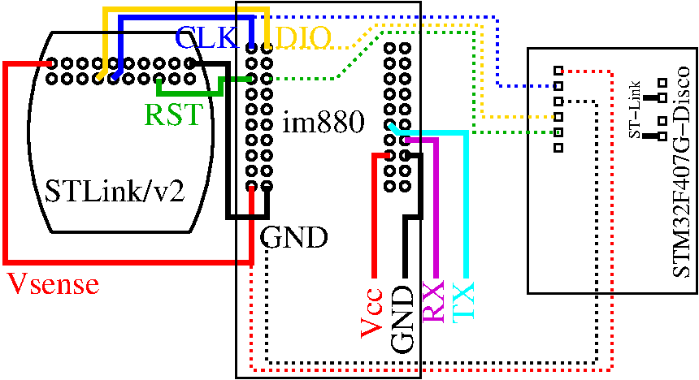

## Compiling

```
CFLAGS="-DISR_STACK_SIZE=2048 -DSTDIO_UART_BAUDRATE=115200 -DSERIAL_BAUDRATE=115200" DRIVER=sx1272 BOARD=im880b make
```

## Flashing through serial port

```
stm32flash -w bin/im880b/lora_GPS.bin /dev/ttyUSB0
stm32flash -w bin/im880b/lora_GPS.bin /dev/ttyUSB1
```

## Flashing through STLink/v2

```
openocd -f interface/stlink-v2.cfg -f target/stm32l1.cfg
```
and

```
gdb-multiarch  bin/im880b/lora_GPS.elf
  target extended-remote localhost:3333
```




