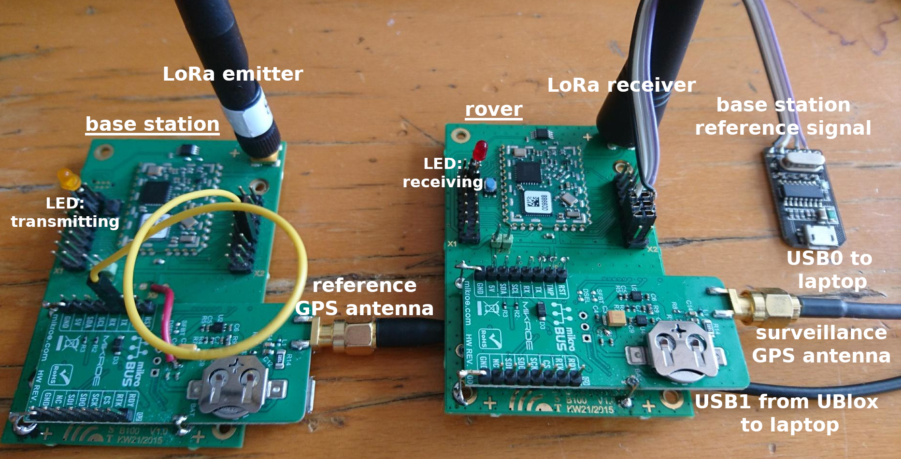
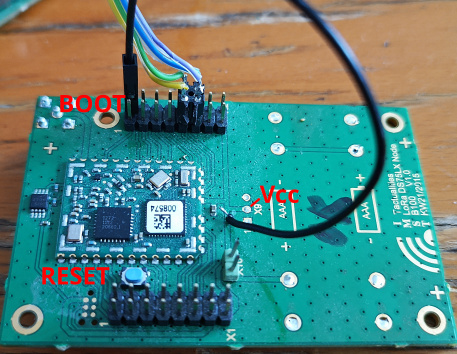
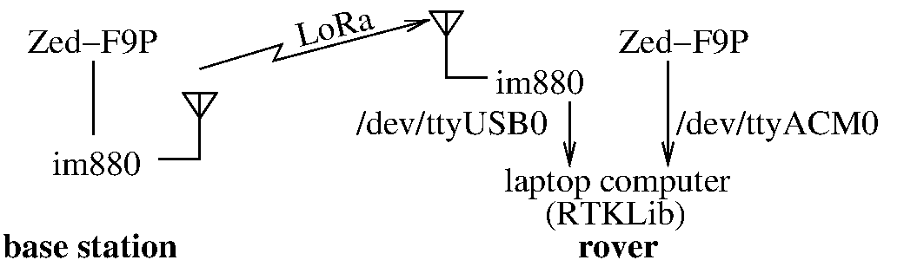
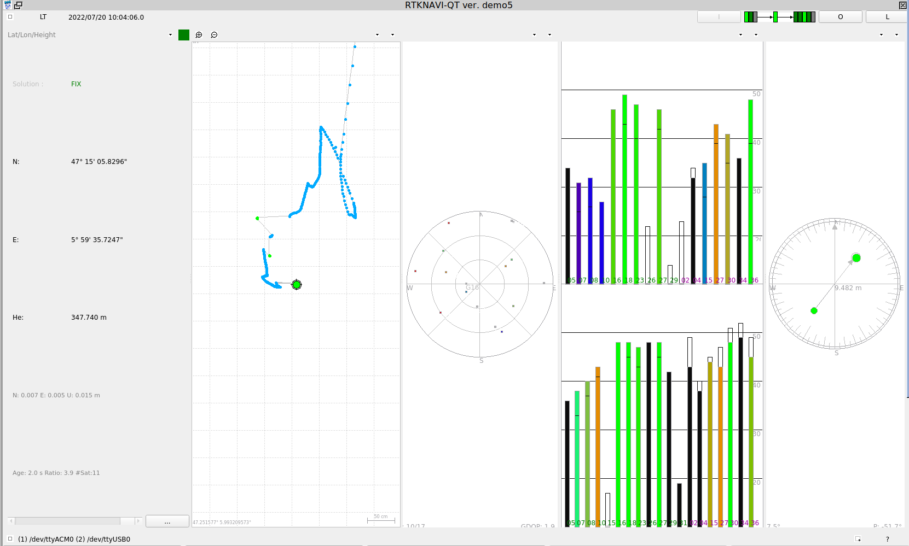
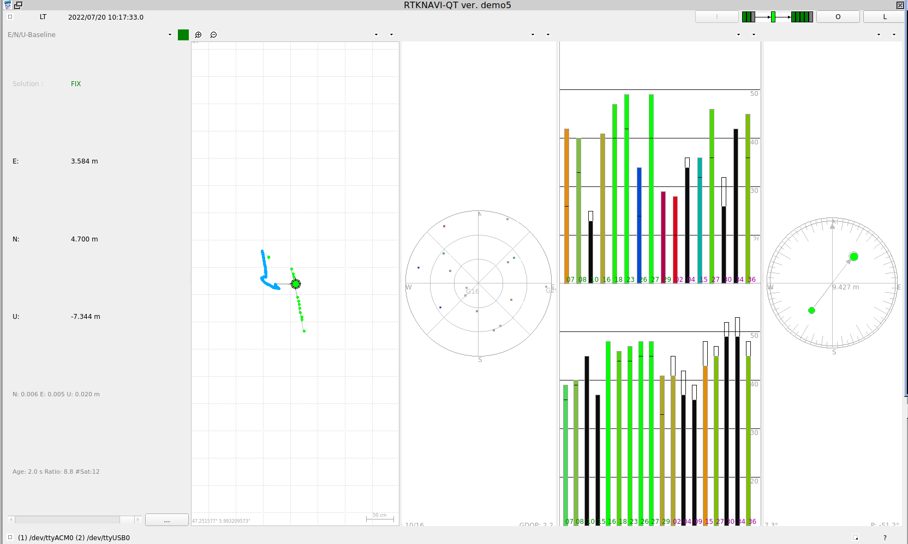
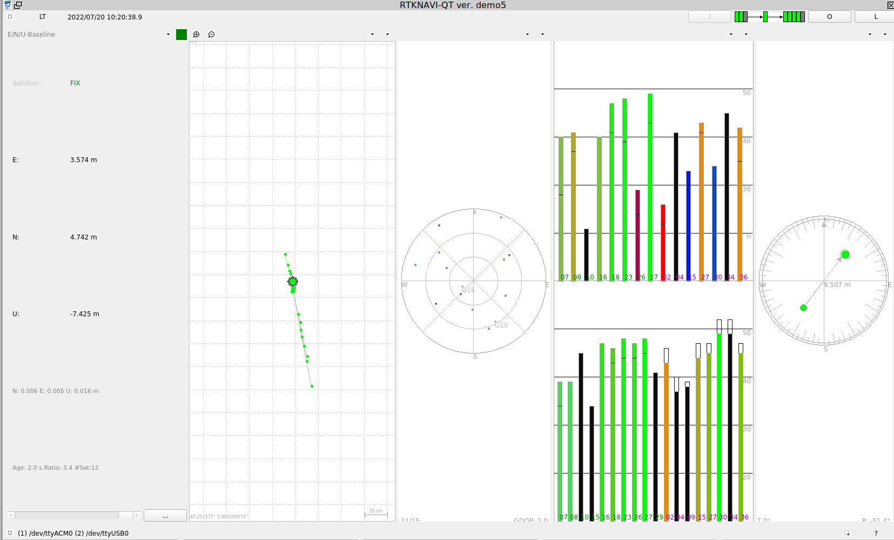
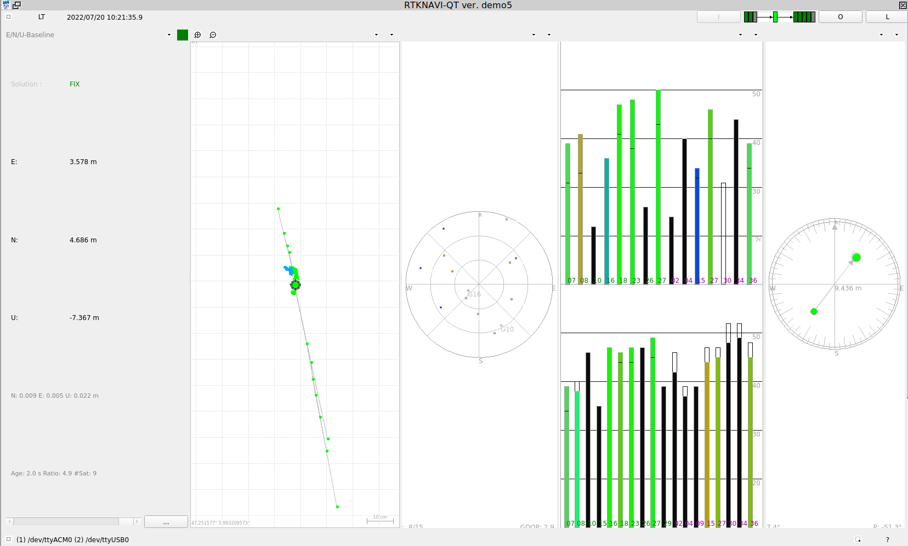
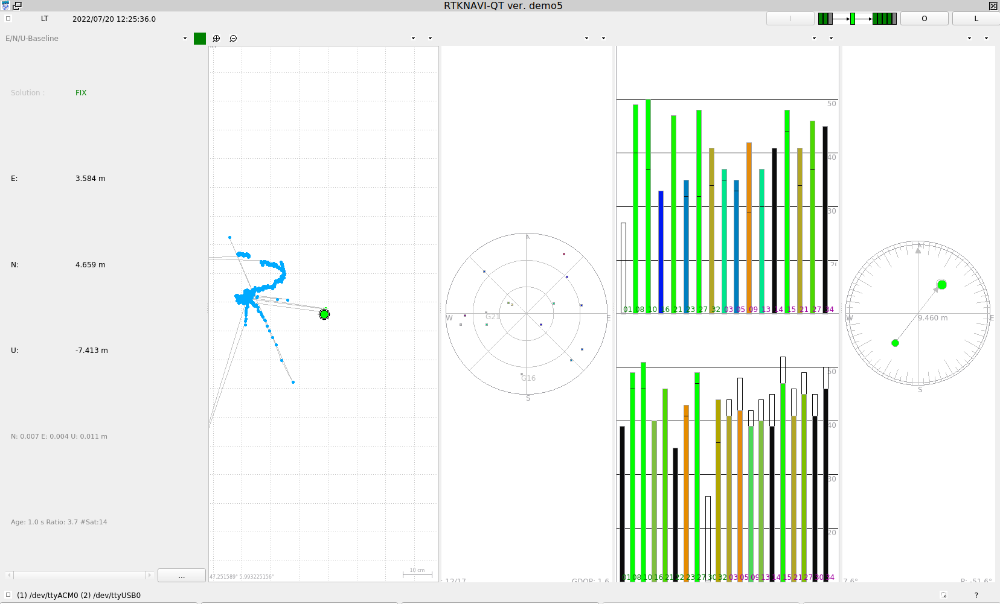
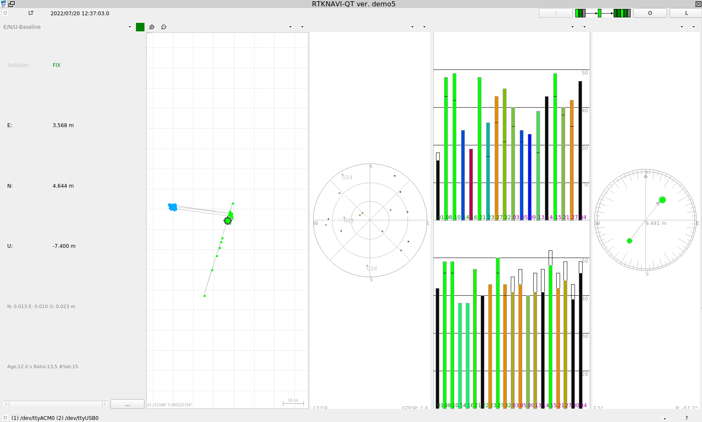

##

See <a href="configuring_ublox.md">configuring_ublox.md</a> for instructions on how to configure 
the UBlox Zed-F9P GNSS receiver to communicate UBX sentences with a small enough payload to be 
transmitted by the LoRa modems.



The rover provides two USB outputs, one with the UBlox rover receiver output and the other
with the messages transmitted from the base station over LoRa: each circuit (UBlox and im880b)
is powered from its own USB cable. The base station is autonomous and is powered by a USB 
Battery block through the UBlox GNSS receiver whose 3.3 V regulator powers the im880b circuit.

See https://github.com/CampusIoT/orbimote/tree/master/field_test_device for a pinout of the motherboard.

## Compiling

Tested with commit 6bf6b6be6c4723b49f62550a35111e57b7426aa4 of RIOT-OS (Thu Aug 20 13:30:38 2020)

```
CFLAGS="-DISR_STACK_SIZE=2048 -DSTDIO_UART_BAUDRATE=115200 -DSERIAL_BAUDRATE=115200" DRIVER=sx1272 BOARD=im880b make
```

## Flashing through serial port

To set the bootloader mode, connect pin 2 of X2 to Vcc (center of X9) and hit the blue reset button.



```
stm32flash -w bin/im880b/lora_GPS.bin /dev/ttyUSB0
stm32flash -w bin/im880b/lora_GPS.bin /dev/ttyUSB1
```

## Flashing through STLink/v2

```
openocd -f interface/stlink-v2.cfg -f target/stm32l1.cfg
```
and

```
gdb-multiarch  bin/im880b/lora_GPS.elf
  target extended-remote localhost:3333
  monitor reset halt
  load
  continue
```

## Application



RTK GPS using UBlox ZED-F9P, one acting as base station (static transmitter) and one acting as
rover (mobile receiver). We have observed that for GPS and Galileo active, using only RAWX messages
in UBX format at 115200 bauds, the payload is about 1200 bytes long or 12000 bits every second.
That's about half the datarate of LoRa set to 500 kHz bandwidth, SF=7 and CR=5 according to
https://www.rfwireless-world.com/calculators/LoRa-Data-Rate-Calculator.html (CR=1 on the website).
We have observed that different settings must be used for transmitter and receiver, namely 
32-byte transmission to avoid communication overhead latencies, and 16-byte reception to avoid
ISR stack corruption. The output of the LoRa receiver (base station messages) on the rover and the 
second UBlox receiver (rover) are fed to ``rtknavi_qt`` set to Kinematic mode, receiving UBX
messages from ``/dev/ttyUSB0`` and ``/dev/ttyACM0``.

Centimetric fix measurement (green) following the float solution (blue):



Evolution of the relative position:





... and after much longer still consistent measurements



